# Autobike manual <!-- omit in toc -->

# Table of contents <!-- omit in toc -->

- [Running the bike](#running-the-bike)
  - [Prerequisites](#prerequisites)
  - [Electronics startup procedure](#electronics-startup-procedure)
  - [Software startup procedure](#software-startup-procedure)
    - [View the code](#view-the-code)
    - [Connect myRIO to your PC](#connect-myrio-to-your-pc)
      - [USB connection](#usb-connection)
      - [WiFi connection](#wifi-connection)
      - [Finishing up connection](#finishing-up-connection)
    - [Uploading the reference trajectory and matrixes](#uploading-the-reference-trajectory-and-matrixes)
    - [Date and time configuration on NI MAX](#date-and-time-configuration-on-ni-max)
    - [Run the code](#run-the-code)
  - [Running the bike outside - trajectory test](#running-the-bike-outside---trajectory-test)
  - [Accessing the logging data on FileZilla](#accessing-the-logging-data-on-filezilla)
    - [Plotting the logging data](#plotting-the-logging-data)
- [Hardware specifics](#hardware-specifics)
  - [myRIO](#myrio)
    - [myRIO WiFi configuration](#myrio-wifi-configuration)
    - [myRIO SSH configuration](#myrio-ssh-configuration)
    - [Building C code for myRIO](#building-c-code-for-myrio)
    - [Uploading C code to the myRIO](#uploading-c-code-to-the-myrio)
    - [Writing new C code](#writing-new-c-code)
  - [ESCON](#escon)
  - [FSESC](#fsesc)
  - [RUT955](#rut955)
    - [Building C code for RUT955](#building-c-code-for-rut955)
    - [Uploading scripts and C code to the RUT955](#uploading-scripts-and-c-code-to-the-rut955)
- [About the code](#about-the-code)
  - [Log files](#log-files)
- [Developing the code](#developing-the-code)
- [Additional resources](#additional-resources)
  - [LabVIEW](#labview)
  - [git](#git)

# Running the bike

## Prerequisites

A computer with the Windows operating system is currently required to use the bikes.

**Make sure to get the 2021 SPI version of all LabVIEW products!**

1. Install [LabVIEW myRIO Software Bundle](https://www.ni.com/sv-se/support/downloads/software-products/download.labview-myrio-software-bundle.html#460313) (licences for Chalmers students may be found [here](https://studentfile.portal.chalmers.se/library/Labview/Software/)).
2. Install [git](https://git-scm.com/downloads)
3. Install [VS Code](https://code.visualstudio.com/Download)
4. For building C code for myRIO (only get these if you know you need them): 
   1. Install the 2018-2019 version of [GNU C & C++ Compile Tools for ARMv7](https://www.ni.com/sv-se/support/downloads/software-products/download.gnu-c---c---compile-tools-for-armv7.html#338448). Use [7-zip](https://www.7-zip.org/download.html) to extract the download to `C:\build\18.0\arm`. The resulting file structure should look as follows:  
      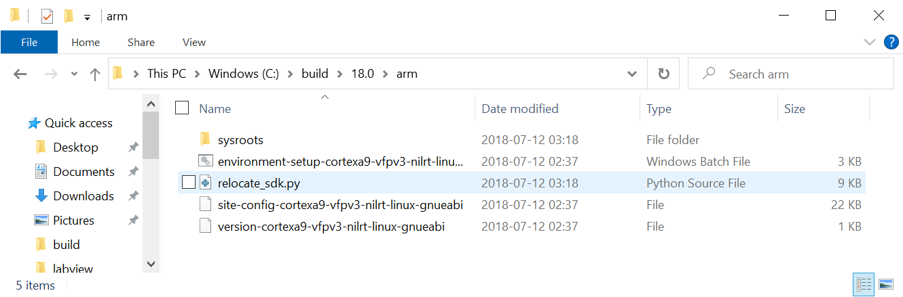
   2. Install [Ninja](https://ninja-build.org/). Make sure to add the folder where `ninja.exe` is located to your `PATH` (instructions [here](https://stackoverflow.com/a/44272417))
   3. Install [CMake](https://cmake.org/download/)
   
   > [Related Documentation](https://nilrt-docs.ni.com/cross_compile/config_dev_system.html)
5. For building C code for RUT955 (only get these if you know you need them):
   1. Install [WSL](https://learn.microsoft.com/en-us/windows/wsl/install). WSL stands for Windows Subsystem for Linux. Windows now ships with linux, allowing you to run a linux distro without using a virtual machine. You should probably get the Ubuntu distro (which is installed by default).

Also have a look at [Additional resources](#additional-resources) to learn more about how to use LabVIEW and git.

## Electronics startup procedure

**OBS: When running the bike indoors at Chalmers, you should never connect the bike to a battery! Instead use a DC power supply to power the bikes.**

First make sure the battery is charged and plugged in.

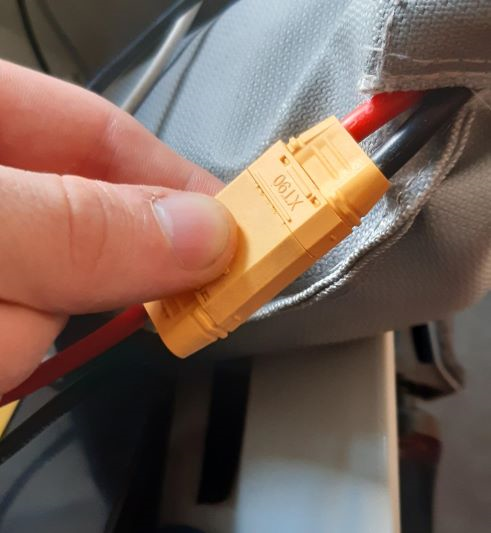  
*Battery connector is plugged in*

Then press the main power switch.

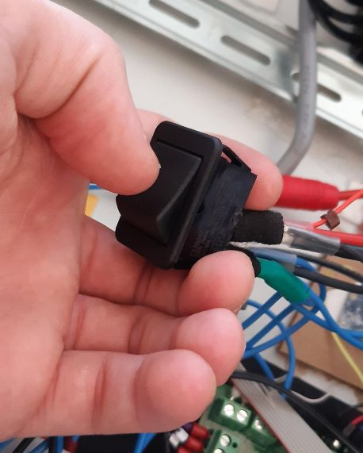  
*Power switched off*

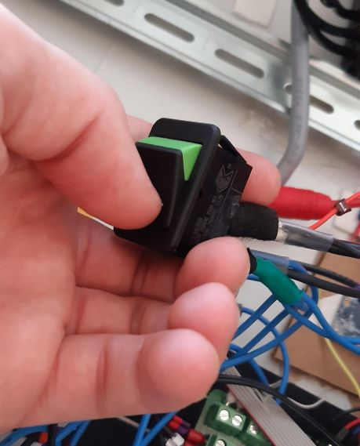  
*Power switched on*

At this point, the MyRIO, RUT955, green PCB, GPS, and IMU boards should receive power. The MyRIO will show a red status LED for a few seconds before the LED goes out. 

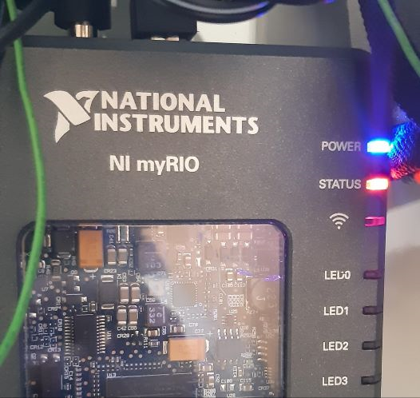  
*The MyRIO shows a red status LED immediately after receiving power*

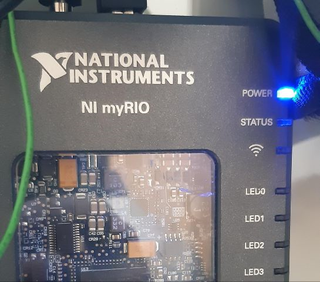  
*The red status LED of the myRIO should go out after a few seconds*

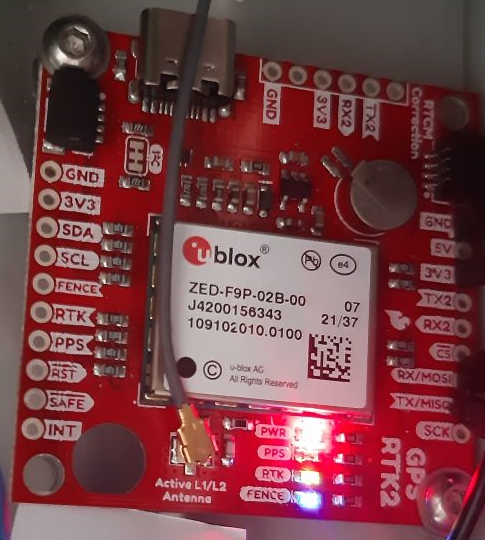  
*The LED:s on the GPS board comes on after it receives power. The PPS LED blinks with a green light.*

After switching on the main power switch and before disabling the emergency stop (estop button), you can connect to the MyRIO via USB or wifi and run programs on it, however, no motors will spin as long as the estop is pressed down or both of the motors are turned off with the motor switches on the side of the box.

If you want to run the motors on the bike, the next step is to disengage the emergency stop (estop). This is done by first pulling up the red stop button, after which you can press the top green button to disengage the estop. The light in the middle of the estop box should come on and stay on after you let go of all buttons. If you failed to pull up the red stop button, the estop will only disengage for as long as you press on the green button.

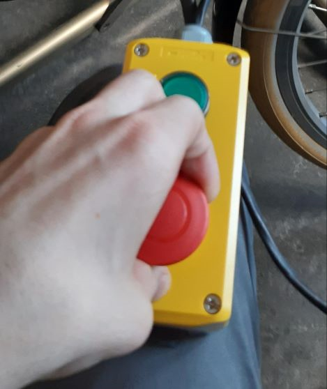  
*First, pull up the red stop button*

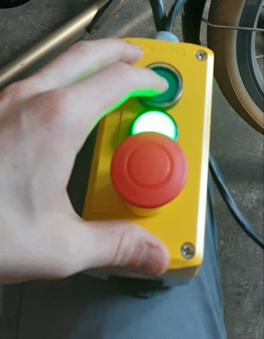  
*Next, press the top green button*

The motor drivers for the forward drive and steering can be individually switched off with switches on the box. You can turn on only the motor you would like to run.

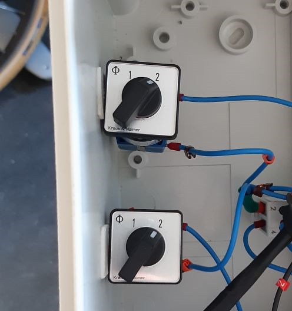  
*The forward and steering motor controllers are both turned off*

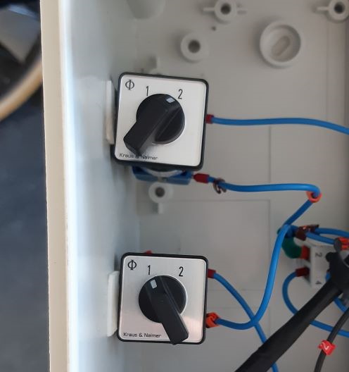  
*Only the steering motor is enabled*

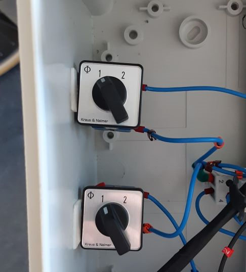  
*The steering and drive motors are both enabled*

When the steering motor is turned on, the steering motor controller should light up a red LED in the corner of the casing. Upon receiving a signal from the myRIO, the steering motor should now be able to turn.

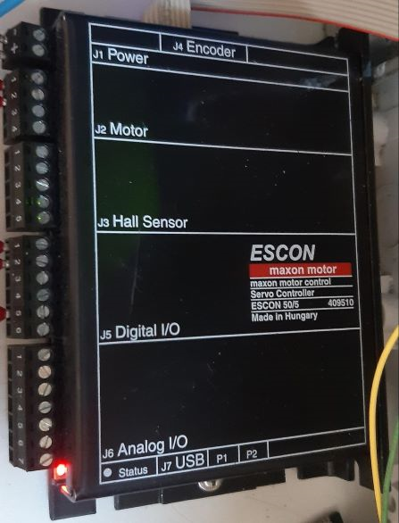  
*Steering motor controller shows a red LED in the corner of the casing, indicating that it is powered on*

When the drive motor is turned on the drive motor controller should light up several LEDs. If no LEDs light up, make sure the power button on the side of the motor controller is pressed down. This button should always be pressed down.

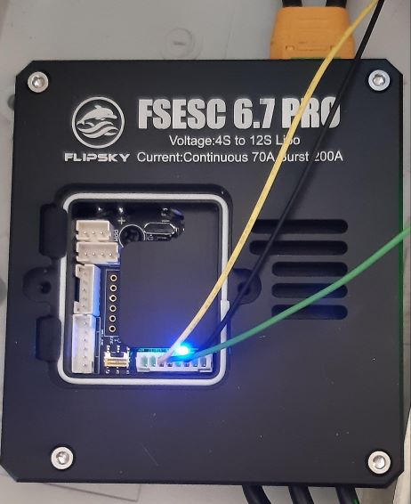  
*Drive motor controller is powered on.*

## Software startup procedure

If you are running the code on new or factory reset bike hardware, make sure to first [configure the hardware](#hardware-specifics) correctly.

### View the code

Open git bash or cmd in a directory of your choosing (However, please **NOTE**: Do not use spaces in the directory path!) and enter

```console
git clone --recurse-submodules https://github.com/OssianEriksson/Autobike/
```

Start LabVIEW and open [`labview/Autobike.lvproj`](./../myrio/labview/Autobike.lvproj). You should now see something like the image below:

  

You are now able to open and edit VIs, but you cannot run the code since the code only runs on myRIOs, and you are not yest connected to one.

Also open the root folder of this repository in VS Code (File > Open Folder...). Installing the recommended VS Code extensions from [extensions.json](../.vscode/extensions.json), either though the popup that shows up when you open the directory in VS Code, or by pressing <kbd>F1</kbd> and selecting "Extensions: Show Recommended Extensions" and installing all the Workspace Recommendations that show up in the left sidebar.

### Connect myRIO to your PC

You can connect the myRIO to a PC using either USB or WiFi. First make sure the myRIO (and optionally the RUT955) is powered on.

#### USB connection

Connect the USB type B port to a USB port on the computer. You might see a popup like the image below. You can safetly ignore or close this window, it is a sign that everything works.  

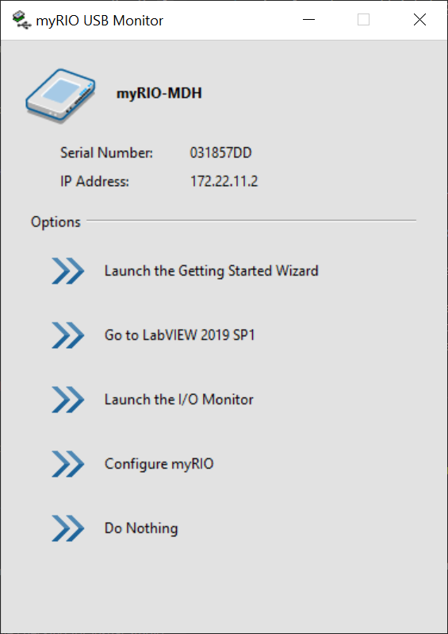

#### WiFi connection

First, the RUT955 must be turned on to provide WiFi. Next, the myRIO must be connected to the WiFi. If the myRIO is already configured to do this, the WiFi LED of the myRIO should become solid blue a few minutes after the WiFi comes online. Otherwise you have to first [connect the myRIO to the RUT955's WiFi](#wifi-connection). Finally, make sure you also connect your own PC to the RUT955's WiFi. Alternatively, as a back-up, you could connect the myRIO (and your PC) to any other available WiFi network (like e.g. WiFi hotspot from your phone).

#### Finishing up connection

Depending on which method you use to connect the myRIO to your PC, it will by default be accessible through different IP:s:

* WiFi: 192.168.1.147
* USB: 172.22.11.2

In order to connect LabVIEW to the myRIO, from the Project Explorer window, right click the "myRIO-1900" entry and select "Properties". Under the "General tab", make sure "IP Address / DNS Name" is set to the correct IP as described above.

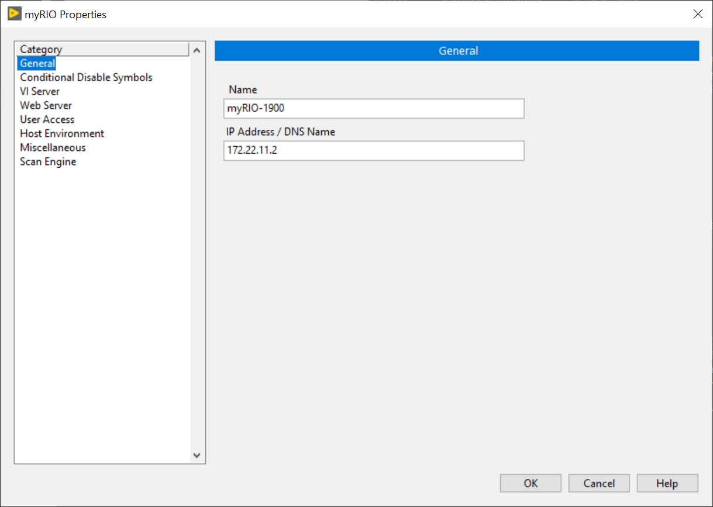  

Finally, close the myRIO Properties window, right click the "myRIO-1900" entry again and select "Connect". Depending on whether the program was already present on the myRIO or not, connection can take long time (5-10 min). During this time LabVIEW can stop responding - just be patient.

### Uploading the reference trajectory and matrixes

You have to upload the reference trajectory and the matrixes to the myRIO.
Make sure the laptop is connected to the bike's myRIO.

On the app FileZilla, enter :

Host : 192.168.1.147

Username : admin

Password : admin

Port : 22

Then Quick Connect

On the right side of your screen is all the data that is on the myRIO.
You have to select the folder in which to upload the trajectory.

Click on the folder with ".." twice : 


Then go to c > ni.rt > startup.

There should be all the previously uploaded reference trajectories and matrixes (and logging data from previous tests) : 


Now on the left part of your screen, select the pc folder where you have saved the trajectory files.
We save the reference trajectory csv files in Github > Simulation > Traj_ref_test
The matrixes are in Github > Simulation > Parameters_matrixmat then go on the folder corresponding to the bike you're testing as well as the speed you want.

Double click the csv files you want to upload to the myRIO : 


This should upload the selected trajectory to the myRIO folder you opened previously on the right part of your screen.

### Date and time configuration on NI MAX

Make sure that the laptop is connected to the myRIO through the Wifi. 
To configure the date and time on the myRIO, go to the software `NI MAX`.
Select `Remote Systems` then the bike you are testing (the green bike is `Autobike`, the red one is `Red Bike`). 
At the bottom of the page, click `Time Settings` and configure the current date and time, then `Save`and `Refresh`.

### Run the code

After turning on the relevant parts of the bike and [connecting to the myRIO](#connect-myrio-to-your-pc), you should just be able to open one of the main VI:s (listed [here](../myrio/labview)) and run it.

You also have to put the correct name of the csv files to have the matrixes and the reference trajectory, in all 3 of these VI:s :


In the following order, run the 3 VI:s :
* `Calibration.vi` - Calibrates the sensors of the bike and updates the calibration parameters in the configuration file mentioned below.
The bike must stand still while calibrating. 
* `Configuration.vi` - Reads and writes configuration parameters of the bike. The current configuration is permanently stored on the myRIO in the file `/c/ni-rt/startup/configuration.xml`.
After running, click `Save`, then `Load`, then `Done`.
* `Main.vi` - The main program to run the motors and control algorithms of the bike.

## Running the bike outside - trajectory test 

Make sure to keep a distance of less than 80 meters between the bike and the computer, or else it might disconnect the myRIO.
Someone has to stay near the bike at all times, and be ready to run with it, catch it and emergency stop it if necessary.

Follow the procedure `Run the code`.

The person in charge of the bike has to hold it as straight as possible : 0 steering angle, 0 roll. 
On the main VI on the laptop : click `Reset and Init trajectory`. Click once more to turn the green light off.

When you're ready, put a constant `speed`.

The person running with the bike has to make sure it is going as straight as possible.

On the computer : `Reset Steering Motor Encoder` and `Enable Steering Motor`.

The one running alongside the bike can now let the bike go.

When you want to stop the test, the person catches the bike and presses emergency stop, or the test can be shut down by clicking on the stop button in LabView.

## Accessing the logging data on FileZilla

Make sure the laptop is connected to the bike's myRIO.

On the app FileZilla, enter :

Host : 192.168.1.147

Username : admin

Password : admin

Port : 22

Then Quick Connect

First, select the folder where you want to save the data on your computer (top left side of the screen).
Usually we save the data in Github > Simulation > Logging_data and add a folder for the type or date of the tests.
Here, we made a folder corresponding to PI speed controller tests : 


At the bottom left, all the files in the selected folder will appear.

Then, on the right side of the screen is where you will find all the data on the myRIO.
Click on the folder with ".." twice : 


Then go to c > ni.rt > startup.

There should be all the logging data from previous tests (and all uploaded reference trajectories and matrixes) : 


Select the one you want then double click on "data.csv" :


A message will appear once the data has been downloaded to your computer.

### Plotting the logging data

Make sure the data to plot is saved on your computer already (see above).

On Matlab, open `Kalman_offline.m`. It is located in the folders `Github > Simulation`.
Add a line to upload your saved data as well as its reference trajectory. 
For example, here we are plotting the data named `data.csv` which is located in the folders Logging_data > PI_speed_controller ; 
and the chosen reference trajectory is a csv file in the Github folder `Traj_ref_test` : 

%data_lab = readtable('Logging_data\PI_speed_controller_tests\data.csv');Table_traj = readtable('Traj_ref_test\trajectorymat_asta0_circle_3_l.csv');

Then you can uncomment the line you want to plot and comment all the other lines :


Then you just have to `Run` the code and all the graphs should appear.

# Hardware specifics

An updated list of hardware parts can be found on the Components tab of [this](https://docs.google.com/spreadsheets/d/1jYklFR16tM9HWh2FWQ4a0sHuk9EQhuwHWUT15zN2rlk/edit?usp=sharing) spreadsheet.

## myRIO

The myRIO has a web UI and is also accessable via SSH (if first enabled through the web UI). The web UI which is used for configuration shares a lot of the interface with [NI MAX](https://knowledge.ni.com/KnowledgeArticleDetails?id=kA03q000000YGQwCAO&l=sv-SE) software which may alternatively be used to configure the myRIO. Both the default web UI and SSH credentials are

* Username: "admin"
* Password: blank (just press enter) or "admin"

To use the web interface, first [connect to the myRIO](#connect-myrio-to-your-pc) and then browse to the myRIO's IP in Internet Explorer (newever browsers won't work). You should get to a page like the image below:

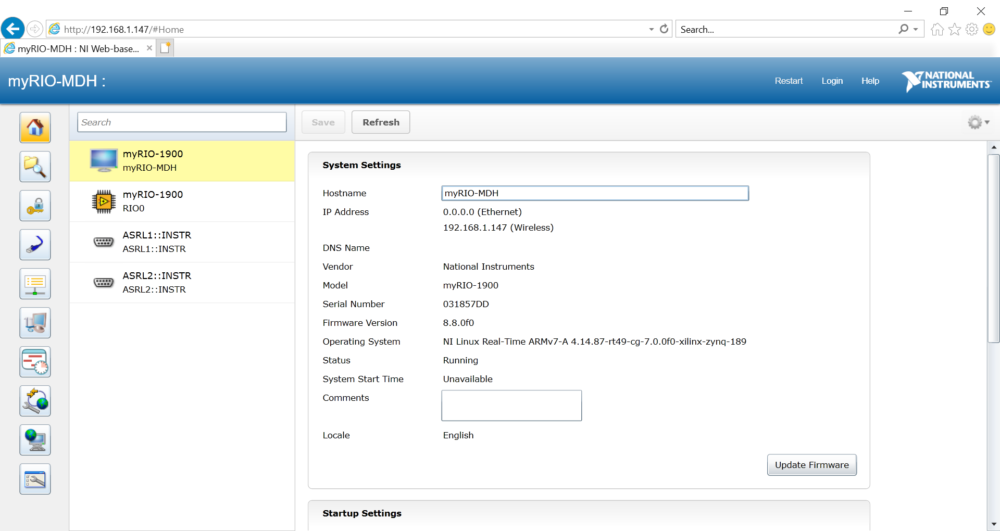  

### myRIO WiFi configuration

Connect to the myRIO and open the Web UI or NI MAX. Under the network tab, you can configure the myRIO to connect to the WiFi of the RUT955, assuming the RUT955 is turned on:

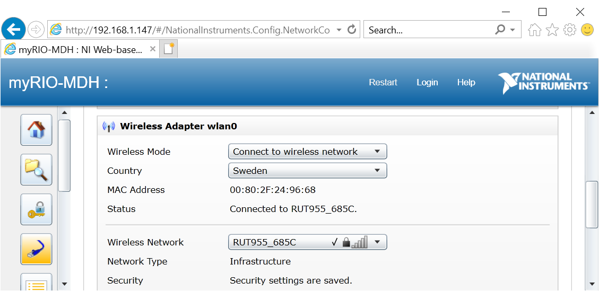  

### myRIO SSH configuration

The ssh server (named sshd) can be enabled from the myRIO web interface or NI MAX. Check the box "Enable Secure Shell Server (sshd)" as shown in the image below, then restart the myRIO.

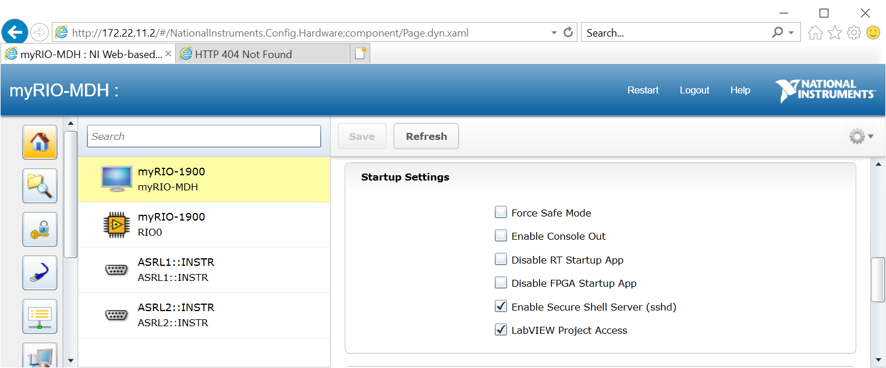  

> [Related documentation](https://knowledge.ni.com/KnowledgeArticleDetails?id=kA03q000000YHpxCAG&l=sv-SE)

### Building C code for myRIO

This project calls C code from LabVIEW code. The C code is compiled outside LabVIEW and then uploaded to the myRIO where the LabVIEW code can access it.

Built C code should alreday be commited to the repo. To build yourself,

1. Press <kbd>F1</kbd>, select "Tasks: Run Task", then "MyRIO: CMake Generate Build Files"  
   This prepares the build configuration
2. Press <kbd>F1</kbd>, select "Tasks: Run Task", then "MyRIO: Ninja"  
   This builds the C code

### Uploading C code to the myRIO

If the SSH server is not enabled on your myRIO (which it is not from the factory), you must [enable it](#myrio-ssh-configuration). Next, press <kbd>F1</kbd>, select "Tasks: Run Task", then "MyRIO: Upload". This task runs the batch script [`upload-to-myrio.cmd`](../myrio/c/upload-to-myrio.cmd) which uploads the built files from [`bin`](../myrio/c/bin/) to the myRIO via `scp`. In the output of the task, answer "Yes" to any questions and enter the password of the myRIO user when prompted.

> [Related Documentation](https://nilrt-docs.ni.com/cross_compile/config_vs_code.html)

### Writing new C code

To create a new C block with your own code in LabVIEW, you need to do three things:

1. Write your C code and put it in [`myrio/c/src`](../myrio/c/src/). See [`balancing_controller.c`](../myrio/c/src/balancing_controller.c) for a basic example. It is recommended to document your code in the style of [Doxygen](https://www.doxygen.nl/manual/docblocks.html).
2. Create a CMake target for your C code by editing [`CMakeLists.txt`](../myrio/c/CMakeLists.txt). You want to add another entry like [this](https://github.com/Autobike/Autobike/blob/4d0ef337a8a46b9b6f841eca9678f09dc1901441/myrio/c/CMakeLists.txt#L29). The [CMake documentation](https://cmake.org/cmake/help/latest/) may be helpful if you are trying to do more advanced builds. After this step you should be able to build and upload your code using the same steps described [here](#building-c-code-for-myrio) and [here](#uploading-c-code-to-the-myrio).
3. In LabVIEW, create a "Call Library Function Node" block and configure it to match your C library function. See [`Balancing Controller.vi`](../myrio/labview/Sub%20VIs/Balancing%20Controller/Balancing%20Controller.vi) for an example.

## ESCON

The ESCON motor controller can be configured using [ESCON Studio](https://www.maxongroup.com/maxon/view/content/escon-detailsite). Notably, you can change which RPM the max and min PWM widths of 10 and 90 percent correspond to. As of writing this document, these values should be set to +-4000 RPM at 10 and 90 percent respectively.

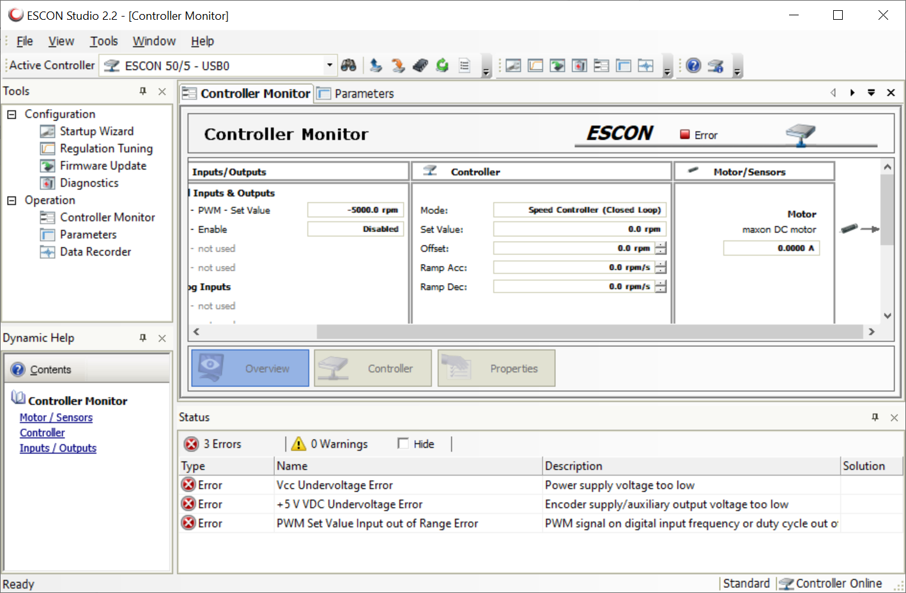  

## FSESC

Can be configured using the [VESC tool](https://vesc-project.com/vesc_tool). Using this tool, the FSESC should be configured for the drive motor which your perticular bike sports. Files containing the configuration of each bike can be found under the [`config`](../config/) directory. These files can be read and applied (and saved) by the VESC tool.

## RUT955

WiFi Passwords:

* Red bike: "Ec78RaFf"

Credentials for ssh login:

* Username: "root"
* Password: "Autobike1"

Or if this does not work the default username/password are

* Username: "admin"
* Password: "admin01"

###  Building C code for RUT955

RTK correction is provided to the u-blox board from the RUT955 over USB. The RTK correction data is read by a program called tiny-ntrip which implemets a client for the ntrip protocol (the protocol used to send RTK corrections). This program is compiled from outside the RUT955 and uploaded to it. The compilation requires a linux computer, or WSL which [you should already have installed](#prerequisites). Beware that the setup of the required build tools can take multiple hours.

1. Launch WSL or your linux computer
2. Run `sudo apt update`
3. Install GNU Make with `sudo apt install make`
4. Install the OpenWRT toolchain according to instructions [here](https://learn.microsoft.com/en-us/windows/wsl/install).
  * Make sure you clone to `~/build/openwrt`: `git clone https://git.openwrt.org/openwrt/openwrt.git ~/build/openwrt`.
  * You may have to use an older commit in order for all the required settings to be present. Do this only if you encouter problems when running `make menuconfig`: `git checkout 41a1a652fbd407a40d55a07bccdbc92770a4c2be`
  * When configuring with `make menuconfig`, Target system should be "Atheros ATH79", Subtarget should be "Generic" and Target Profile should be "Teltronika RUT955".
  * You don't need to set the `PATH` variable as it is automatically set for you in [`tasks.json`](../.vscode/tasks.json).
5. Open the Autobike project from VS Code inside WSL according to instructions from [here](https://code.visualstudio.com/docs/remote/wsl#_open-a-remote-folder-or-workspace).
6. Press <kbd>F1</kbd>, select "Tasks: Run Task", then "RUT955: Make"  
   This builds the C code

> [Related Documentation](https://openwrt.org/docs/guide-developer/helloworld/start)

### Uploading scripts and C code to the RUT955

If you previously built C code for the RUT955 yourself, for this next part, make sure you are not using WSL.

Make sure the RUT955 is running and that you are connected to its WiFi. Next, press <kbd>F1</kbd>, select "Tasks: Run Task", then "RUT955: Upload". This task runs the batch script [`upload-to-rut955.cmd`](../rut955/upload-to-rut955.cmd) which uploads scripts from [`scripts`](../rut955/scripts/) and the built files from [`bin`](../rut955/bin/) to the RUT955 via `scp`. In the output of the task, answer "Yes" to any questions and enter the password of the RUT955 user when prompted.

# About the code

Note that no custom bitfile is loaded to the myRIO FPGA. By default, LabVIEW then loads a default FPGA bitfile which interfaces with the blocks seen under the `myRIO` section in the functions palette. If one customizes the FPGA, then the blocks under the `myRIO` section will no longer work since they rely on the default FPGA functionality. In our case, all the functionality we need is already implemented in the default FPGA and accessible though the `myRIO` blocks, so we can keep the default FPGA.

The LabVIEW code makes use of the LabVIEW Real-Time module in order to run multiple tasks in parallel. In order to pass data between tasks, we currently use Data Value References. We tried using Tag Channels, however these really hurt performance (possibly because we used them to pass large clusters).

## Log files

Logs from each run of the bike are stored on the myRIO in the directory `/c/ni-rt/startup`. These logs are not deleted by default, so if the bike runs for long enough the myRIO can run out of storage.

# Developing the code

First make sure you are able to [run the bike](#running-the-bike).

> [Related Documentation](https://nilrt-docs.ni.com/cross_compile/config_vs_code.html)

# Additional resources

## LabVIEW

* *Recommended*: [LabVIEW tutorials on YouTube](https://www.youtube.com/watch?v=1WiE__onbeY&t=1178s&ab_channel=LabVIEWExercises)

## git

* *Recommended*: [Introduction to git on YouTube](https://www.youtube.com/watch?v=HVsySz-h9r4)
